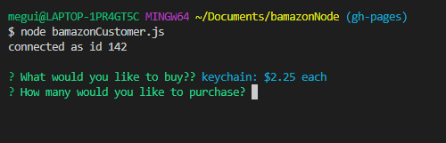
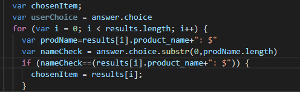

# bamazonNode
Upon running bamazonCustomer.js the user will get a list of products with a cost next to each item. They can scroll through the entire list and select what they would want.

Once user selects a product, they will be asked how many they wish to purchase.

I am particularly proud of how I got the application to check the name when the order was placed. Instead of just saying .includes I wanted to make sure similar items were not counted (such as "teddy bear" vs "pair of teddy bears")
the code that I used to do that is using substring and the particular way that the choices were laid out with product name being followed by ": $" to figure out where the product name ended. 

If the product has enough stock to fulfill the order the application will thank the user for their order and give them an overall total. The database stock will be updated to reflect what has been ordered.

If the product does not, the application will inform the user that their is not sufficent stock and will not adjust the database.

